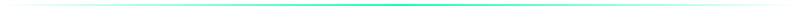
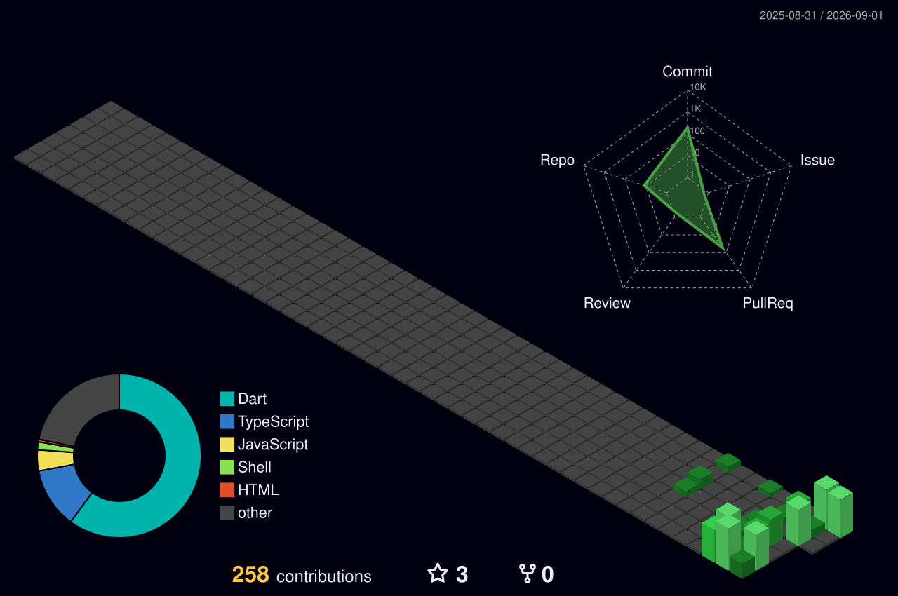

<!--
  GitHub profile README — BiasManan2010 / Manan Bharti
  Palette: deep navy #0B1D36  ·  electric green #00FF9F  ·  ink #070B14
  Drop this repo's contents into BiasManan2010/BiasManan2010 (special profile repo).

  Banner: assets/banner.svg (monospace MB wordmark + SMIL matrix rain).
  Optional Canva swap: 1100×280, navy #0B1D36, accent #00FF9F, centered "MB".
-->

<div align="center">

<!-- ========== 1. HEADER ========== -->


<br>

[](https://github.com/BiasManan2010)

<br>

<!-- ========== 7. TABLE OF CONTENTS (near top) ========== -->
<p>
  <a href="#about"><strong>About</strong></a>
  &nbsp;·&nbsp;
  <a href="#tech-stack"><strong>Tech Stack</strong></a>
  &nbsp;·&nbsp;
  <a href="#stats"><strong>Stats</strong></a>
  &nbsp;·&nbsp;
  <a href="#projects"><strong>Projects</strong></a>
  &nbsp;·&nbsp;
  <a href="#connect"><strong>Connect</strong></a>
</p>



</div>

<br>

<!-- ========== 2. ABOUT — MODEL CARD ========== -->
<h2 id="about" align="center">Model Card</h2>

<div align="center">

```text
┌─────────────────────────────────────────────────────────────────┐
│  MODEL CARD                                                     │
│  ─────────────────────────────────────────────────────────────  │
│  Model:      Manan Bharti                                       │
│  Version:    Diploma-v1                                         │
│  Status:     Training                                           │
│  Lab:        Thapar Institute  →  B.Tech track (queued)         │
│  Stack:      JavaScript, TypeScript, React, Node.js, Python,    │
│              C, C++ (in progress)                               │
│  Objective:  minimizing the gap between where I am and          │
│              building production-grade AI systems               │
│  Specializes: ML · DL · NLP · LLMs                              │
└─────────────────────────────────────────────────────────────────┘
```

`loss = ||prod_AI − me||² + λ·curiosity` &nbsp;—&nbsp; currently overfitting on ambition, underfitting on sleep.

</div>

<br>

<details>
<summary><strong>▸ hyperparameters &amp; notes</strong></summary>
<br>

- Computer Science **Diploma** student at **Thapar Institute**, transitioning into **B.Tech** at Thapar.
- Building toward an **AI Engineer** path: models, language, and systems that actually ship.
- Current weights: JS / TS / React / Node / HTML / CSS / Python. Loading: **C** and **C++**.
- Optimizer: curiosity. Batch size: one stubborn student. Checkpoint: every repo below.

</details>

<br>
<div align="center"></div>
<br>

<!-- ========== 3. TECH STACK ========== -->
<h2 id="tech-stack" align="center">Tech Stack</h2>

<div align="center">

**Languages**

[](https://skillicons.dev)

<br>

**Frameworks / Libraries**

[](https://skillicons.dev)

<br>

**Tools**

[](https://skillicons.dev)

<br>


</div>

<br>
<div align="center"></div>
<br>

<!-- ========== 4. TRAINING LOG ========== -->
<h2 align="center">training_log.txt</h2>

<div align="center">

```text
$ tail -f ~/training_log.txt

[epoch 00] split=class_10_cbse          loss=1.000  acc=baseline
           note: first forward pass. gradients noisy. spirit intact.

[epoch 01] split=diploma_thapar         loss=0.41   acc=climbing   ◀ you are here
           note: Computer Science Diploma @ Thapar Institute.
           stack_update: JS/TS/React/Node/Python; C/C++ still warming up.

[epoch 02] split=btech_thapar           loss=queued  lr=scheduled
           note: B.Tech at Thapar — next checkpoint. weights will transfer.

[epoch 03] split=ai_engineer            loss→min    status=objective
           note: production-grade ML / DL / NLP / LLM systems.
           early_stopping=never

>> val_loss is trending down. keep training.
```

</div>

<br>
<div align="center"></div>
<br>

<!-- ========== 5. STATS / TROPHIES / 3D GRAPH ========== -->
<h2 id="stats" align="center">GitHub Stats</h2>

<!-- 2-column layout: stats + streak on row 1; trophies span row 2. Images at width=100% so they shrink on mobile. -->
<div align="center">
<table>
  <tr>
    <td width="50%" align="center" valign="top">
      
    </td>
    <td width="50%" align="center" valign="top">
      
    </td>
  </tr>
  <tr>
    <td width="50%" align="center" valign="top">
      
    </td>
    <td width="50%" align="center" valign="top">
      
    </td>
  </tr>
</table>
</div>

<br>

<div align="center">

**3D contribution graph**



<sub>Generated by <a href="https://github.com/yoshi389111/github-profile-3d-contrib">yoshi389111/github-profile-3d-contrib</a>. After you publish this special repo, run <em>Actions → GitHub-Profile-3D-Contrib → Run workflow</em> once so the SVG appears.</sub>

</div>

<br>
<div align="center"></div>
<br>

<!-- ========== 6. FEATURED PROJECTS ========== -->
<h2 id="projects" align="center">Featured Projects</h2>

<div align="center">
<table>
  <tr>
    <td width="50%" valign="top">
      <h3><a href="https://github.com/BiasManan2010/zeppay">zeppay</a></h3>
      Offline-first UPI client — QR pay, splits, requests, autopay.
      <br><br>
      
      
      
      
    </td>
    <td width="50%" valign="top">
      <h3><a href="https://github.com/BiasManan2010/tpc_patiala">tpc_patiala</a></h3>
      Academic portal for Thapar Polytechnic — roles, timetable, AI insights.
      <br><br>
      
      
      
      
    </td>
  </tr>
  <tr>
    <td width="50%" valign="top">
      <h3><a href="https://github.com/BiasManan2010/MathLOG">MathLOG</a></h3>
      Math workspace — notes, graphs, calendars, KaTeX, Next.js.
      <br><br>
      
      
      
      
    </td>
    <td width="50%" valign="top">
      <h3><a href="https://github.com/BiasManan2010/birthdaymath">birthdaymath</a></h3>
      Interactive birthday letter — four questions that spell a name.
      <br><br>
      
      
      
    </td>
  </tr>
  <tr>
    <td width="50%" valign="top">
      <h3><a href="https://github.com/BiasManan2010/Real-Time-Chat-website-like-Whatsapp">Real-Time Chat</a></h3>
      WhatsApp-style chat in the browser — Node server, live rooms.
      <br><br>
      
      
      
    </td>
    <td width="50%" valign="top">
      <h3><a href="https://github.com/BiasManan2010/notion-charts-deploy">notion-charts-deploy</a></h3>
      Deploy wrapper for unlimited charts inside Notion.
      <br><br>
      
      
    </td>
  </tr>
</table>
</div>

<br>

<details>
<summary><strong>▸ older / archive</strong></summary>
<br>

| Repo | Note |
| :--- | :--- |
| [sahai](https://github.com/BiasManan2010/sahai) | Early experiment — kept as a checkpoint in the log. |
| [spy_cam](https://github.com/BiasManan2010/spy_cam) | Early experiment — not part of the current training run. |

</details>

<br>
<div align="center"></div>
<br>

<!-- ========== 8. CONNECT ========== -->
<h2 id="connect" align="center">Connect</h2>

<div align="center">

<a href="https://www.linkedin.com/in/manan-bharti"></a>
<a href="mailto:mananbhartilks@gmail.com"></a>
<a href="https://github.com/BiasManan2010"></a>

</div>

<br>
<div align="center"></div>
<br>

<!-- ========== 9. FOOTER ========== -->
<div align="center">


<br><br>


<br><br>

<sub>trained daily · evaluated in public · deployed someday</sub>
<br>
<sub>© Manan Bharti · BiasManan2010</sub>

</div>
