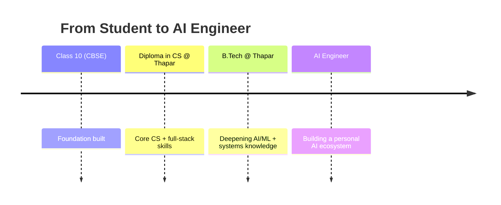

<div align="center">


</div>

<br/>

<div align="center">

```
[BOOT SEQUENCE]
> Initializing Manan.exe ................ [OK]
> Loading core stack ...................... [OK]
> Mounting AI/ML modules ................... [OK]
> Starting AI Engineer training program ... [IN PROGRESS]
> System ready.
```

</div>

<div align="center">

```
BiasManan2010@github ~ $ ./profile-scan --live --deep
```

</div>

<table>
<tr>
<td width="45%" valign="top">

**`VISUAL.MAP`**

```
░░░░░░░░░░░░░░░░░░░░
░░▒▒▒▒▓▓▓▓▓▓▒▒▒▒░░░░
░▒▓▓████████▓▓▒░░░░
▒▓██▓▓░░░░▓▓██▓▒░░░░
▓██▓░░▒▒▒▒░░▓██▓░░░░
▓█▓░▒▓████▓▒░▓█▓░░░░
▓█▓░▓██░░██▓░▓█▓░░░░
▓██▓░▒▓▓▓▓▒░▓██▓░░░░
▒▓██▓▒░░░░▒▓██▓▒░░░░
░▒▓████▓▓████▓▒░░░░
░░▒▒▓▓▓▓▓▓▓▓▒▒░░░░░░
░░░░▒▒▒▒▒▒▒▒░░░░░░░░
```
<sub>live ASCII render of avatar</sub>

</td>
<td width="55%" valign="top">

**`SYSTEM.INFO`**

| Field | Value |
|---|---|
| Subject | Manan Bharti |
| Handle | [`@BiasManan2010`](https://github.com/BiasManan2010) |
| Role | Full-Stack Developer \| AI Engineer |
| Status | 🟢 Building • Learning • Shipping |
| Repos |  |
| Followers |  |
| Contact | `[EMAIL]` |

</td>
</tr>
</table>

<div align="center">
<sub># every panel above is live-rendered — no workflows, no cron jobs, no committed assets</sub>
</div>

<br/>

## 💬 Quote of the Visit

<div align="center">


<br/>
<sub># reloads a new quote on every profile visit</sub>

</div>

## ♟️ Puzzle of the Day

<div align="center">


<br/>
<sub># a fresh position rendered live on every page load — swap the FEN to change the puzzle</sub>

</div>

## `whoami`

```ts
const manan: Developer = {
  name: "Manan Bharti",
  role: "Full-Stack Developer | AI Engineer",
  location: "Punjab, India",
  building: "my own AI ecosystem, one system at a time",
  stack: ["JavaScript", "TypeScript", "React", "Node.js", "Python", "C", "C++"],
  focus: ["Machine Learning", "Deep Learning", "NLP", "LLMs", "AI Systems"],
  mantra: "Ship fast, learn faster.",
};
```

<div align="center">

<table>
<tr>
<td align="center" width="25%">

🟣 **Full-Stack**
<br/>
<sub>Frontend + Backend</sub>

</td>
<td align="center" width="25%">

🔵 **AI Engineer**
<br/>
<sub>ML • DL • NLP • LLMs</sub>

</td>
<td align="center" width="25%">

🟢 **Builder**
<br/>
<sub>ships fast</sub>

</td>
<td align="center" width="25%">

🔴 **Hackathon Ready**
<br/>
<sub>SIH 2026</sub>

</td>
</tr>
</table>

</div>

## 🗺️ Career Timeline



## 🏆 Achievements

<div align="center">


</div>

**Certifications**
<br/>

<sub>— swap in real certification badges as you complete them</sub>

**Hackathons**
<br/>


## 🧠 Knowledge Graph

<div align="center">

<svg width="640" height="290" xmlns="http://www.w3.org/2000/svg" font-family="Fira Code, monospace">
  <style>
    .lbl { fill: #c9d1d9; font-size: 13px; }
    .bg { fill: #1a1a1a; rx: 4; }
    .bar { rx: 4; }
  </style>

  <text x="0" y="15" class="lbl">JavaScript / TypeScript</text>
  <rect x="0" y="22" width="600" height="10" class="bg"/>
  <rect x="0" y="22" width="510" height="10" class="bar" fill="#39FF14"/>

  <text x="0" y="50" class="lbl">React / Node.js</text>
  <rect x="0" y="57" width="600" height="10" class="bg"/>
  <rect x="0" y="57" width="480" height="10" class="bar" fill="#39FF14"/>

  <text x="0" y="85" class="lbl">Python</text>
  <rect x="0" y="92" width="600" height="10" class="bg"/>
  <rect x="0" y="92" width="450" height="10" class="bar" fill="#00E5FF"/>

  <text x="0" y="120" class="lbl">C / C++</text>
  <rect x="0" y="127" width="600" height="10" class="bg"/>
  <rect x="0" y="127" width="300" height="10" class="bar" fill="#00E5FF"/>

  <text x="0" y="155" class="lbl">Machine Learning / Deep Learning</text>
  <rect x="0" y="162" width="600" height="10" class="bg"/>
  <rect x="0" y="162" width="240" height="10" class="bar" fill="#FF6EC7"/>

  <text x="0" y="190" class="lbl">NLP / LLMs</text>
  <rect x="0" y="197" width="600" height="10" class="bg"/>
  <rect x="0" y="197" width="210" height="10" class="bar" fill="#FF6EC7"/>

  <text x="0" y="225" class="lbl">System Design / AI Architecture</text>
  <rect x="0" y="232" width="600" height="10" class="bg"/>
  <rect x="0" y="232" width="180" height="10" class="bar" fill="#FFD166"/>

  <text x="0" y="265" class="lbl">▮ Core Stack   ▮ Applied   ▮ AI/ML Focus   ▮ Systems</text>
</svg>

</div>

## 🛠️ Tech Stack

**Languages**
<br/>


**Frontend**
<br/>


**Backend**
<br/>


**AI / ML**
<br/>


**Tools**
<br/>


## 🎵 Now Playing

<div align="center">


<br/>
<sub># requires your own free deploy of novatorem/spotify-github-profile — see setup notes below</sub>

</div>

## ⏱️ Coding Activity (WakaTime)

<!--START_SECTION:waka-->
```text
Connect WakaTime and run the wakatime-readme-stats action
to auto-populate this weekly language breakdown.
```
<!--END_SECTION:waka-->

## 🧩 Competitive Programming

<div align="center">


</div>
<sub>— swap in your LeetCode username to activate this card</sub>

## 📊 3D Contribution Graph

<div align="center">
<picture>
  <source media="(prefers-color-scheme: dark)" srcset="https://raw.githubusercontent.com/BiasManan2010/BiasManan2010/profile-3d-contrib/profile-night-green.svg" />
  <source media="(prefers-color-scheme: light)" srcset="https://raw.githubusercontent.com/BiasManan2010/BiasManan2010/profile-3d-contrib/profile-day-green.svg" />
  
</picture>
<br/>
<sub># generated daily via .github/workflows/profile-3d-contrib.yml</sub>
</div>

## 🐍 Contribution Snake

<div align="center">
<picture>
  <source media="(prefers-color-scheme: dark)" srcset="https://raw.githubusercontent.com/BiasManan2010/BiasManan2010/output/github-contribution-grid-snake-dark.svg" />
  <source media="(prefers-color-scheme: light)" srcset="https://raw.githubusercontent.com/BiasManan2010/BiasManan2010/output/github-contribution-grid-snake.svg" />
  
</picture>
<br/>
<sub># generated via .github/workflows/snake.yml — the snake literally eats your commit graph</sub>
</div>

## 📈 Activity

<div align="center">


</div>

## 🚧 Currently Building

- ⚡ A shift-management PWA (Next.js + Firebase)
- 🤖 An AI-powered project for hackathon prep
- 🏆 Prepping for **Smart India Hackathon 2026**

<details>
<summary>🎲 Fun facts (click to reveal)</summary>
<br/>

- I'm on a mission to build my own local AI models and a personal AI assistant.
- My long game: become an industry-level AI Engineer who ships production-ready AI systems.
- This whole README updates itself — no manual edits needed for the stats, graphs, or streaks.

</details>

<br/>

<div align="center">


<br/>
<sub>scan to visit this profile</sub>

<br/><br/>


[](https://github.com/BiasManan2010)
[](LINKEDIN_URL)
[](mailto:EMAIL)
[](BUYMEACOFFEE_URL)

<sub>Support goes toward hosting demos, new hardware for training models, and staying caffeinated ☕</sub>
<br/>
<sub># thanks for stopping by</sub>

</div>
